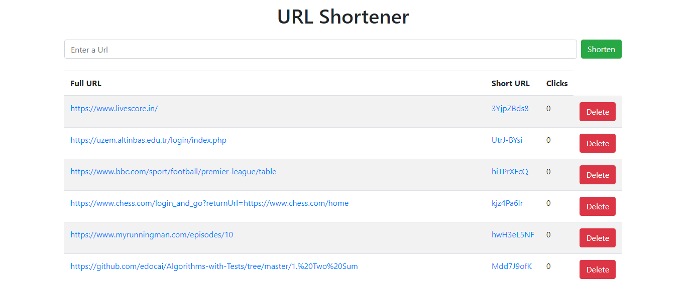

## URL Shortener
This is a URL shortening service built using TypeScript, Node.js, Express.js, and MongoDB.

<h2 align="center">
  
  <br>
</h2>

### Getting Started
Clone the repository:

```bash
  git clone https://github.com/yourusername/url-shortener.git
```

Install the dependencies:

```bash
  npm install
```

Start the development server:

```bash
  npm start
```

Access the application at http://localhost:5000

### Features
Shorten long URLs into shorter, more manageable links
Redirect shortened URLs to their original destination
View statistics on clicks for each shortened URL

### Technologies
TypeScript: A superset of JavaScript that adds optional types, making it easier to catch errors and improve code maintainability
Node.js: A JavaScript runtime that allows you to run JavaScript on the server-side
Express.js: A popular Node.js web framework for building web applications and APIs
MongoDB: A document-oriented NoSQL database used for storing the URLs and click statistics

### Conclusion
This is a basic URL shortening service that demonstrates the use of TypeScript, Node.js, Express.js, and MongoDB. Feel free to use it as a starting point for your own projects or to extend its functionality.
